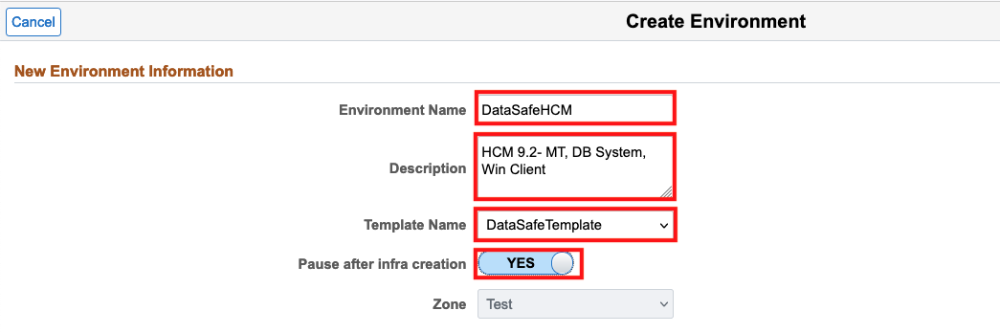
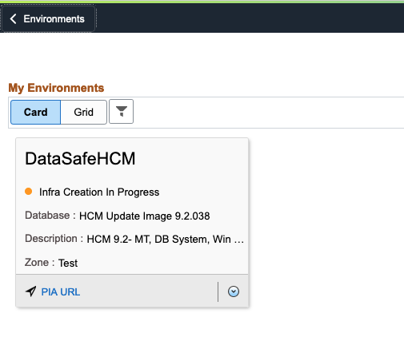
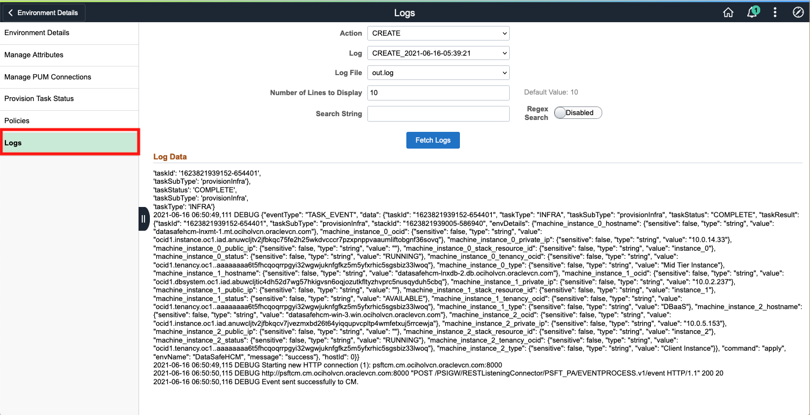
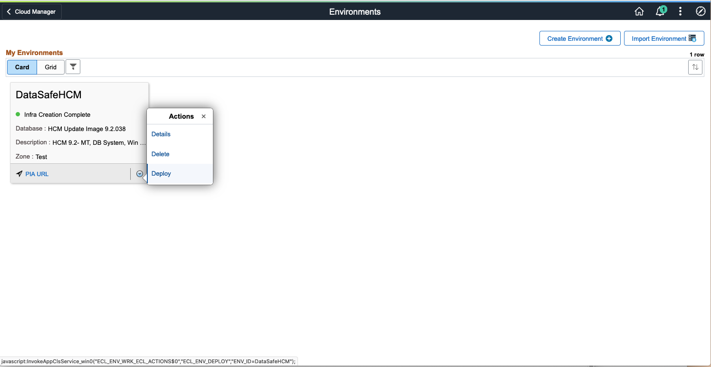
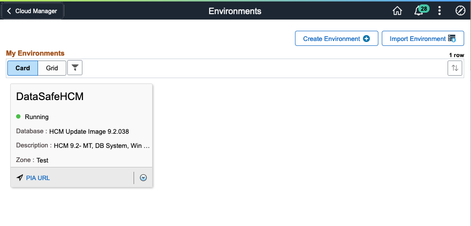

# Configure PSFT Environment 
 
## Introduction

This lab guides you through configuring a PSFT environment on Cloud Manager. To Provision Cloud Manager, please follow this lab. Then, return to this lab after Lab :___ . We will now create the topology, environment template and environment. For Data Safe to work, your PSFT environment must have a DB Systems node. 

Estimated Lab Time: 15 minutes

### Objectives
In this lab you will:
* Create a topolgy for a template to automatically provision a PeopleSoft environment
* Give it required attributes including name, description, OS, shape type, and environment type

### Prerequisites
- Access to the PSFT Cloud Manager console


## **STEP 1**: Defining a Topology

1. Navigate to **Dashboard** > **Topology**.
    

    Since none of these will meet our needs for Data Safe, we will need to create a new one.
    Click **Add New Topology** on the top right.
    

2. Now let's edit the Topogy we just created. 
    Topology Name: **DataSafeTop**
    Description: **MT, DB System & Win Client** 

    As our description states, we will be creating a Topology with three nodes:
    * Middle Tier
    * Database System
    * Windows Client

    Click **Add Node** to do so.
    

    a. **Middle Tier**
    - Operating System: **Linux**
    - Environment Type: **Middle Tier**
    - Shape Name: **VM.Standard2.1**
    - Disk Space (GB): **200**
    - Appserver: **Yes**
    - Webserver: **Yes**
    - Process Scheduler: **Yes**
    - COBOL: **No**
    

    Click **Done**

    b. **DB System**
    - Operating System: **Linux**
    - Environment Type: **DB Systems**
    - Shape Name: **VM.Standard2.1**
    - Disk Space (GB): **256**
    
    
    Click **Done**

    c. **Windows Client**
    - Operating System: **Windows**
    - Environment Type: **PeoplesoftClient**
    - Shape Name: **VM.Standard2.1**
    - Disk Space (GB): **200**
    
    Click **Done**

3. Verify your newly created Topology
    When you have something like this, click **Save**. 
    

## **STEP 2**: Creating a New Environment Template
   Navigate to Cloud Manager Dashboard -> **Environment Template**
   

   Click **Add New Template** button.
   

1. On the General Details page, provide the values below: 
    * Give your environment a unique **Name** such as **DataSafeTemplate** 
    * For **Description**, we'll use **HCM 9.2- MT, DB System, Win Client**
    * Click on the **Search Icon**. Do NOT type anything. If your DPK was downloaded properly, it should appear in the Search Results. If you can't see it yet, please wait and refresh the page after awhile. Since we subscribed to the HCM channel in the previous lab, we see **PEOPLESOFT HCM UPDATE IMAGE 9.2.037 - NATIVE OS** (see 2nd screenshot below).

   

   

   Click **Next**.

2. On the Select Topology page: 
    * Click on the **Search Icon** to search for a topology and select **DataSafeTop** topology. 
    
    
    * Expand the **Custom Attributes** section and select **DataSafeTop** again in the dropdown. 
    * Click on **Edit Custom Attributes**

    

    * Expand the **Region and Availability Domains** section and select your values from the corresponding dropdowns. ("Demo" and "OCIHOLVCN" should match up with the PeopleSoft on OCI LiveLab)

    

    * Expand the **Middle Tier** -> **Network Settings** section and again, select your values from the corresponding dropdowns.

    

    * Expand the **DB Systems** -> **General Settings** and make the following 2 changes:
    Database Operator Id: **PS** 
    Database Name: **HCMDB**
    Make note of 11. PDB Name
   
    

    * Expand the **DB Systems** -> **Network Settings** section and again, select your values from the corresponding dropdowns.

    

    * Expand the **DB Systems** -> **DB System Options** and make the following 3 changes:
    Software Release: **Oracle Database 19c** 
    Display Name: **HCMDB**
    Software Edition: **Enterprise Edition**
   
    

    * Expand the **PeopleSoft Client** -> **Network Settings** section and again, select your values from the corresponding dropdowns.

    

    Click **Next**
    

3. On the Define Security page:
   * Click on the Search Icon and Select **Test** for Zone Name from the Search Results
   
   * Click on the Search Icon again for Role Name. This time, expand **Search Criteria**, type **PACL_CAD**, **PACL_PAD**, **PACL_SSC**, and click Search. Select it under Role Name. 
  
    Your screen should look like this:

    

    Click **Next**

4. On the Summary page:

   * Review the details and click **Submit** to save the template. 

    


## **STEP 3**: Creating a New PeopleSoft Environment

1. Navigate to Dashboard --> **Environments**  
  
  Click Create Environment button.

  

2. Provide a New Environment Information:
    * Environment Name - **DataSafeHCM** 
    * Description. 
    * Select the Template that was created in previous section – **DataSafeTemplate**. 
    * Toggle over radio button to **yes** for **Pause after infra creation**.  

  

3. Go to **Environment Attributes -> Middle Tier -> Credentials**

  Give following values to the field.

  No. | Name | Value
  --- | --------- | -----------
  2 | Weblogic Administrator Password | Psft1234
  4 | Gateway Administrator Password | Psft1234
  5 | Web Profile Password for user PTWEBSERVER | Psft1234
  
  

4. Go to **DB Systems -> Credentials**
  No. | Name | Value
  --- | --------- | -----------
  1 | Database Administrator Password | PSft1234##
  3 | Database Connect Password | Psft1234
  5 | Database Access Password | Psft1234
  7 | Database Operator Password | Psft1234

  

5. Go to **PeopleSoft Client -> Credentials**
  
  No. | Name | Value
  --- | --------- | -----------
  1 | Windows Administrator Password | Psft1234567#      

  

6. Scroll up to the top and ckick **Done**
  

7. This will create the infrastructure first. Refresh the page to see the status change from **Initiating** to **Infra Creation In Progress**. To monitor, click the **v** arrow and then **Details**. 
   
Same as before, switch to the **Logs** tab to monitor the creation. This will take about 90 minutes.
  

8. Once the infrastucture has been created, you should see the status change to **Infra Creation Complete**. Click the **v** arrow, and then **Deploy**
   

9. You can monitor the deployment the same way by checking the Logs. After another 90 minutes, you should see the status change again to **Running**
  

  
As a note, these are the login credetials for the PSFT HCM environment:
      ```
      Username : PS
      Password: Psft1234
      ```

You may now proceed to the next lab.


## Learn More

* [Oracle Data Safe Documentation](https://docs.oracle.com/en/cloud/paas/data-safe/udscs/get-started-oracle-data-safe.html)
* [Learn how to set up Data Safe with a Compute Database](https://docs.oracle.com/en/cloud/paas/data-safe/udscs/register-oracle-databases-oracle-cloud-infrastructure-compute-instances.html#GUID-304A2F0E-67B1-44E4-AD48-649F1FE59DAC)
* [Learn how to register an on-premise database with a Private Endpoint](https://docs.oracle.com/en/cloud/paas/data-safe/udscs/register-premises-oracle-databases-using-oracle-data-safe-private-endpoint.html#GUID-61F946FF-5AFB-4BB3-9BAB-7BABC9B4A6C4)
* [Learn how to register an on-premise database with an On-Premises Connector](https://docs.oracle.com/en/cloud/paas/data-safe/udscs/register-onpremises-oracle-databases-using-oracle-data-safe-onpremises-connector.html#GUID-ED6C6F89-3123-4A4E-9EBE-30D2C920C1CA)

## Acknowledgements

* **Author:** Sara Lipowsky, Cloud Engineering
* **Last Updated By/Date:** Sara Lipowsky, June 2021

## Need Help?
Please submit feedback or ask for help using our [LiveLabs Support Forum](https://community.oracle.com/tech/developers/categories/livelabsdiscussions). Please click the **Log In** button and login using your Oracle Account. Click the **Ask A Question** button to the left to start a *New Discussion* or *Ask a Question*.  Please include your workshop name and lab name.  You can also include screenshots and attach files.  Engage directly with the author of the workshop.

If you do not have an Oracle Account, click [here](https://profile.oracle.com/myprofile/account/create-account.jspx) to create one.
