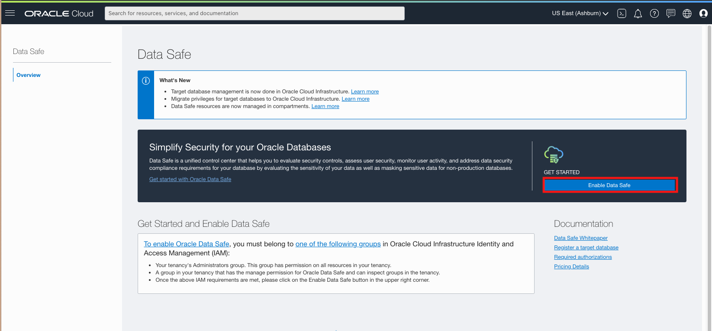

# Enable Data Safe 

## Introduction

This lab guides you through enabling Data Safe on OCI and creating a Private Endpoint to which we will connect our target database.  

Estimated Lab Time: 10 minutes

### Objectives

In this lab, you will:
* Enable Data Safe on your tenancy
* Set up a private endpoint for Data Safe
* Configure the Security List rules to open a connection between the Private Endpoint and the target database

### Prerequisites

* A tenancy admin user
* A paid Oracle Cloud Infrastructure tenancy (not available for Free Tier or Always Free tenancies)
* A private Virtual Machine Database System 
* A text file with the following values: 
    - The private IP address of the database to be targeted on Data Safe
    - (Optional) The public IP address of the bastion host you will use to connect to the database 
    - The OCID of the target database

## **STEP 1:** Gathering Needed Information
In Lab 1, we created an HCM PSFT environment with a Middle Tier, DB System and Windows Client nodes. In Step 3, before deploying our environment, we created the infrastructure. Included in that is our DB System we will be connecting Data Safe to.

1. Sign into your OCI tenancy using your admin account. 
2. Open up the menu on the far left and click **Oracle Database** --> **Bare Metal, VM, and Exadata**
    
3. On the left, use the dropdown to select the **Demo** compartment. Next, click **HCMDB**.
    
4. Click **Nodes** on the bottom left, then copy the Private IP address into a NotePad for later.
    

## **STEP 2:** Enable Data Safe

This step is not necessary if Data Safe is already been used in you tenancy and region. If it is not, follow these steps:

1. Sign into your OCI tenancy using your admin account if you aren't already signed in.
2. Open up the menu on the far left and click **Oracle Database** --> **Data Safe**
    

3. Click **Enable Data Safe**
    
    

## **STEP 3:** Create a Private Endpoint for the Database

1. After enabling Data Safe, the button should change to **Service Console**. On the left side, click on **Private Endpoints**. 

    

2. Click **Create Private Endpoint**.
    

Now let's give it some values:

  * **Name** - psftPE
  * **Compartment** - Demo
  * **Virtual Cloud Network** - OCIHOLVCN
  * **Subnet:** db
    

Click **Create Private Endpoint**

Once the endpoint has finished creating, the status should change to **Acceted**. 
3. Copy the Private IP address in the same location you copied the DB Node's Private IP making sure to label each one. We will be using this later. 

    

## **STEP 4:** Download Privileges Script

While we're here, click the **Register Wizard** and theen **Download Privileges Script**

<!-- ## **STEP 4:** Configure the Security List rules

1. Open Security List rules to allow traffic between the endpoint and the database. Go to **Networking** > **Virtual Cloud Networks** and select the VCN in which your target database resides.

  a. Navigate to the subnet that contains the database. Modify its Security list.

  b. Create an Ingress Rule that allows TCP traffic from the Private Endpoint's private IP address to port 1521. 

  c. Create an Egress Rule that allows TCP traffic from the database's private IP address to port 1521. 

     -->

You may now move on to the next lab.

## Learn More

* [Oracle Data Safe Documentation](https://docs.oracle.com/en/cloud/paas/data-safe/udscs/get-started-oracle-data-safe.html)
* [Learn how to set up Data Safe with a Compute Database](https://docs.oracle.com/en/cloud/paas/data-safe/udscs/register-oracle-databases-oracle-cloud-infrastructure-compute-instances.html#GUID-304A2F0E-67B1-44E4-AD48-649F1FE59DAC)
* [Learn how to register an on-premise database with a Private Endpoint](https://docs.oracle.com/en/cloud/paas/data-safe/udscs/register-premises-oracle-databases-using-oracle-data-safe-private-endpoint.html#GUID-61F946FF-5AFB-4BB3-9BAB-7BABC9B4A6C4)
* [Learn how to register an on-premise database with an On-Premises Connector](https://docs.oracle.com/en/cloud/paas/data-safe/udscs/register-onpremises-oracle-databases-using-oracle-data-safe-onpremises-connector.html#GUID-ED6C6F89-3123-4A4E-9EBE-30D2C920C1CA)

## Acknowledgements

* **Author:** Sara Lipowsky, Cloud Engineering
* **Last Updated By/Date:** Sara Lipowsky, June 2021

## Need Help?
Please submit feedback or ask for help using our [LiveLabs Support Forum](https://community.oracle.com/tech/developers/categories/livelabsdiscussions). Please click the **Log In** button and login using your Oracle Account. Click the **Ask A Question** button to the left to start a *New Discussion* or *Ask a Question*.  Please include your workshop name and lab name.  You can also include screenshots and attach files.  Engage directly with the author of the workshop.

If you do not have an Oracle Account, click [here](https://profile.oracle.com/myprofile/account/create-account.jspx) to create one.
