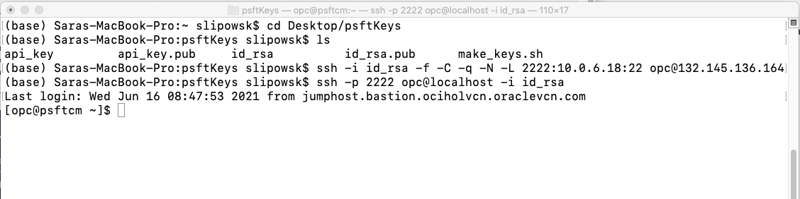
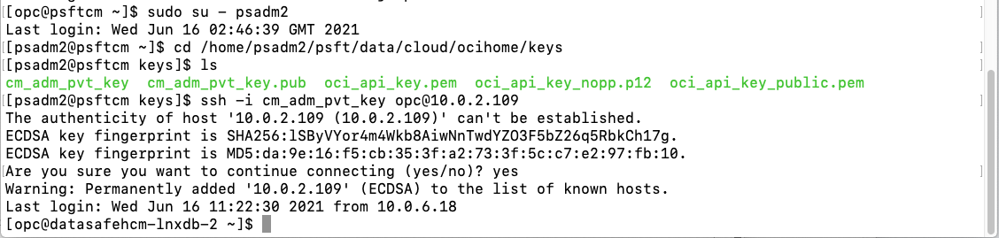
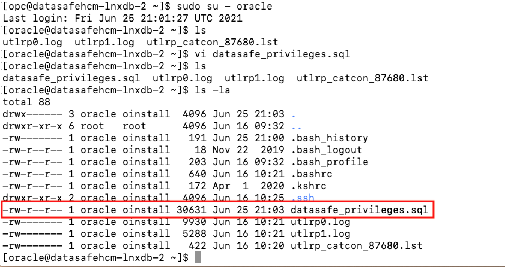
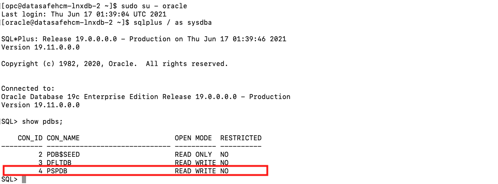
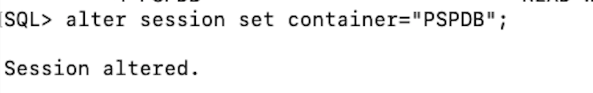
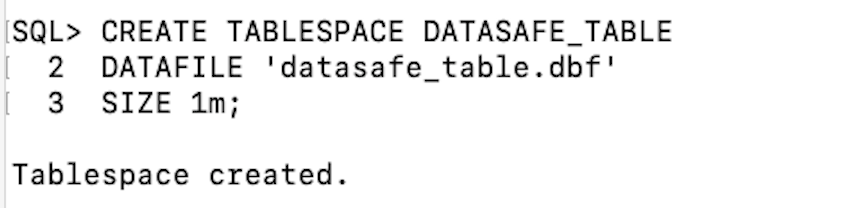
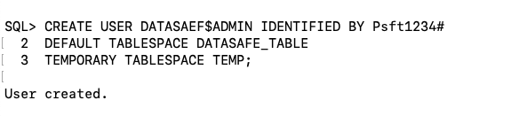
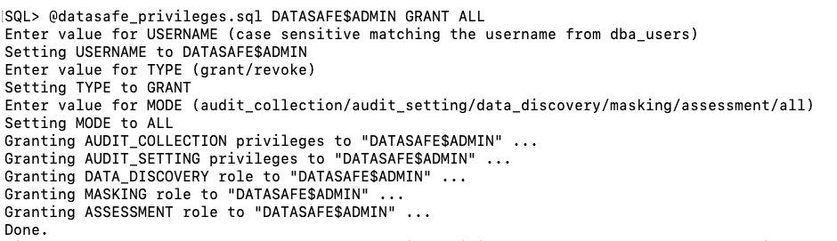
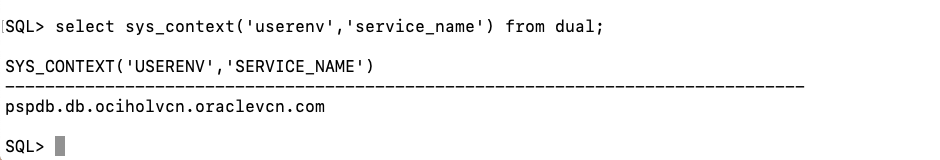
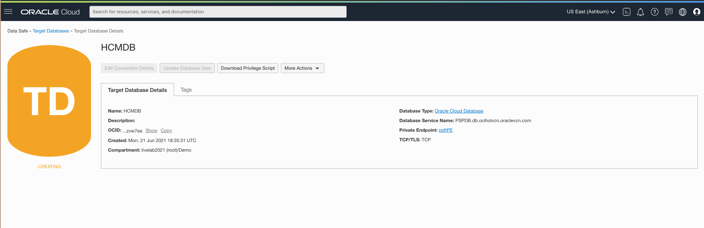

# Configure the Target Database 
 
## Introduction

This lab guides you through configuring the target database for use with Data Safe. We will be downloading a privilege script from Data Safe in order to create a user on the database that will act as the Data Safe Admin User. This user will have certain permissions outlined the in the downloaded privileges script. 

Note: Please be aware that the screenshots in this lab follow the enabling of Data Safe for an EBS instance. This is not required and simply provides the walkthrough of a typical "installment" of Data Safe on a database. 

Estimated Lab Time: 15 minutes

### Objectives

In this lab, you will:
* Download a privileges script from the Data Safe Console
* Create a Data Safe user on the target database and grant the user the appropriate privileges

### Prerequisites

* A tenancy admin user
* A paid Oracle Cloud Infrastructure tenancy (not available for Free Tier or Always Free tenancies)
* A private Virtual Machine Database System 
* A text file with the following values: 
    - The private IP address of the database to be targeted on Data Safe
    - (Optional) The public IP address of the bastion host you will use to connect to the database 
    - The OCID of the target database


## **STEP 1:** Configure Privilieges Script

1. Let's now log into our DB VM. 
    a. SSH back into your Cloud Manager. Refer back to PSFT on OCI LiveLab, Lab 2, Step 7 or 8. If you're using a Windows machine, use Putty. On a Mac, it should look like this:

    

    b. From here, change to the psadm2 user  
    ```sudo su - psadm2```

    c. Change to the keys directory  
    ``cd /home/psadm2/psft/data/cloud/ocihome/keys``  

    d. SSH into DB node. You copied the **DB\_NODE\_PRIVATE\_IP** into a text file in the previous lab, Step 1.  
    ``ssh -i cm_adm_pvt_key opc@<DB_NODE_PRIVATE_IP>``

    All together, it should look like this:
    

2. Create datasafe_privileges.sql file.

    a. In the database vm, change to the oracle user  
    * ``sudo su - oracle``  
    b. Create the empty file  
    * ``vi datasafe_privileges.sql``  
    c. Press ``i`` to start inserting values into the file.  
    d. Now paste in the contents of the downloaded file into the file we just created on the database.  
    e. Save and exit by pressing ``esc`` and then typing in ``:wq``. 

Check that it's there:
    


## **STEP 2:** Prepare Target Database
In this step, we will create a database user and grant them privileges which will allow them to be used as the Data Safe admin user. 

1. If you aren't already, switch over to the `oracle` user.
    ``sudo su - oracle``
2. Connect to SQLPlus as the sysdba user.  
    ``sqlplus / as sysdba``
3. We need to get the pluggable database name  
    ``show pdbs;``

    

4. Now alter the session:

    ``alter session set container="<pdb-name>";``

    
5. Before we are able to create a user, we must create a tablespace on the database that will act as the user's default tablespace. 

    * ``CREATE TABLESPACE DATASAFE_TABLE ``

    * ``DATAFILE 'datasafe_table.dbf'``

    * ``SIZE 1m;``
    
6. Now we can create the user that will act as our Data Safe user on this database. 

    ``CREATE USER DATASAFE$ADMIN IDENTIFIED BY <password>``

    ``DEFAULT TABLESPACE DATASAFE_TABLE``

    ``TEMPORARY TABLESPACE TEMP;``

    

7. Grant permissions to this user. 

    ``GRANT CONNECT, RESOURCE TO DATASAFE$ADMIN;``
    
8. Now run the following command to grant privileges to this user. 

    ``@datasafe_privileges.sql DATASAFE$ADMIN GRANT ALL``
    
9. Note down the Database Service Name for later reference.

    ``select sys_context('userenv','service_name') from dual;``
    
    

## **STEP 3:** Register Database Using the Wizard
Click **Start Wizard** on Oracle Cloud Databases  
Register Cloud Databases (DB System)  
1. Select Database  
    a. Change the compartment to Demo and then select **HCMDB** from the dropdown  
    b. Data Safe Target Display Name: **HCMDB**  
    c. Compartment: **Demo**  
    d. Database with Private IP? **Yes**  
    e. Database Service Name: pspdb.db.ociholvcn.oraclevcn.com (or output from Step 1, #7)

    Now enter the User Name and Password of the user you created in Step 1, #6  
    f. Database User Name:  
    g. Database Password:  

Click **Next**

2. Connectivity Option  
This should already be filled out. Click **Next**

3. Add Security Rule  
In both of the dropdowns, select **db_sec**. This is the security list associated with the db subnet.

4. Review and Submit  
Click **Register**

5. Now, **HCMDB** should be in the registration process.  
    

You may now move on to the next lab. 


## Learn More

* [Oracle Data Safe Documentation](https://docs.oracle.com/en/cloud/paas/data-safe/udscs/get-started-oracle-data-safe.html)
* [Learn how to set up Data Safe with a Compute Database](https://docs.oracle.com/en/cloud/paas/data-safe/udscs/register-oracle-databases-oracle-cloud-infrastructure-compute-instances.html#GUID-304A2F0E-67B1-44E4-AD48-649F1FE59DAC)
* [Learn how to register an on-premise database with a Private Endpoint](https://docs.oracle.com/en/cloud/paas/data-safe/udscs/register-premises-oracle-databases-using-oracle-data-safe-private-endpoint.html#GUID-61F946FF-5AFB-4BB3-9BAB-7BABC9B4A6C4)
* [Learn how to register an on-premise database with an On-Premises Connector](https://docs.oracle.com/en/cloud/paas/data-safe/udscs/register-onpremises-oracle-databases-using-oracle-data-safe-onpremises-connector.html#GUID-ED6C6F89-3123-4A4E-9EBE-30D2C920C1CA)

## Acknowledgements

* **Author:** Sara Lipowsky, Cloud Engineering
* **Last Updated By/Date:** Sara Lipowsky, June 2021

## Need Help?
Please submit feedback or ask for help using our [LiveLabs Support Forum](https://community.oracle.com/tech/developers/categories/livelabsdiscussions). Please click the **Log In** button and login using your Oracle Account. Click the **Ask A Question** button to the left to start a *New Discussion* or *Ask a Question*.  Please include your workshop name and lab name.  You can also include screenshots and attach files.  Engage directly with the author of the workshop.

If you do not have an Oracle Account, click [here](https://profile.oracle.com/myprofile/account/create-account.jspx) to create one.
